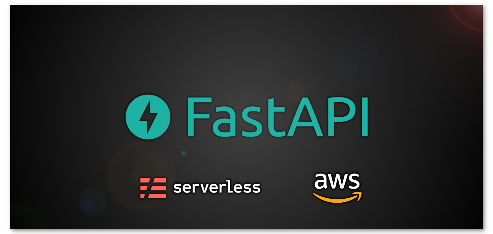

Serverless REST API on AWS with FastAPI
==================




This starter kit shows how to deploy a serverless REST API on AWS using:
* Python
* Poetry
* FastAPI
* Serverless framework

### Installation
### Local development

```bash
make serve
```
### Deployment
#### Deploy locally
1. If you have Serverless account
```bash
npx serverless login
```
Then you will be able to login using your browsers.


If you havent created a project before, please go to your Serverless dashboard and create a new project, it must have same name as your app name (on the serverless.yaml file):


In this example:


After that, run the following command to deploy
```bash
make deploy
```
2. If you do not have Serverless account
Simply run the following command to deploy
```bash
make deploy
```

